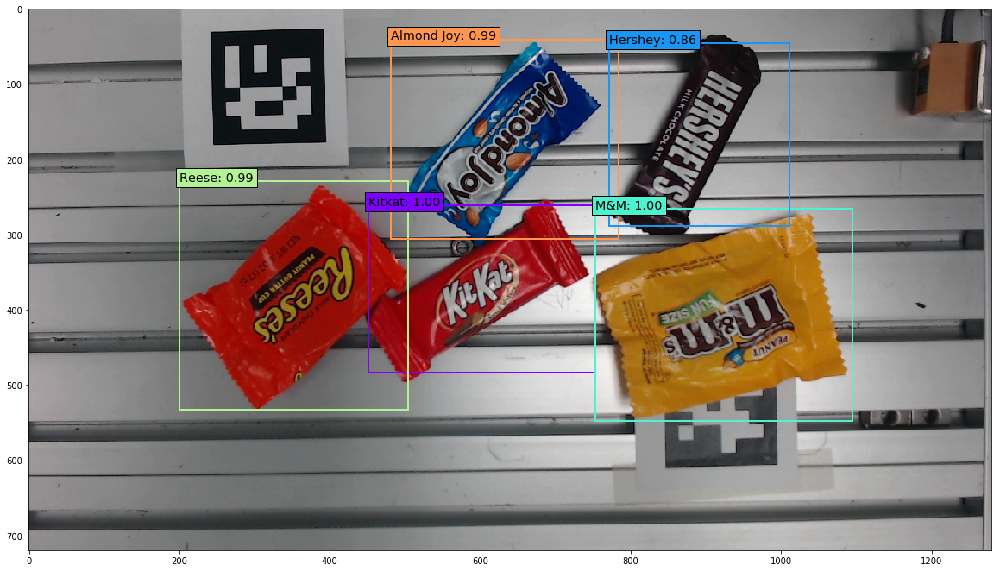
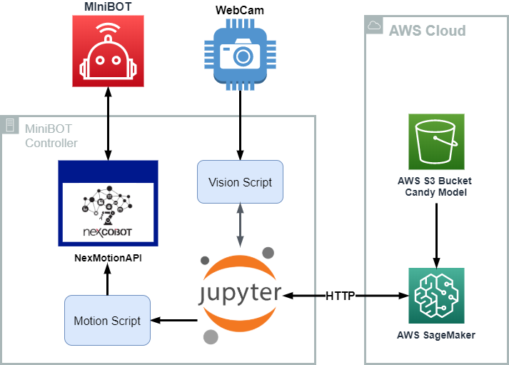
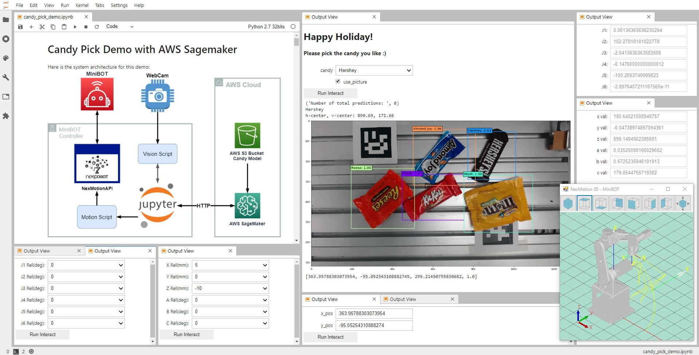

# MiniBOT candy picking demo
This demo presents how to use NexCOBOT [MiniBOT](http://www.nexcom.com/Products/industrial-computing-solutions/machine-automation/education-robot-solution/ethercat-nexrobo-minibot-robot) to pick candy with AWS SageMaker as inference engine.

In this demo, we use AWS SageMaker to label our candy dataset, train a SSD model, and setup endpoint to do inference.
I will create another repo for the detail. 


Here is the result of the inference (also a youtube link of demo video):

<a href="https://youtu.be/2Wl_zsUDQKc">
  
</a>


## System Architecture


## MiniBOT software environment setup for candy picking
The OS platform of MiniBOT controlller is Windows 7 32-bit

### Pre-requirement
* Install `NexMotion Studio` to get NexMotion C/C++ API and NexMotion.dll.
* Create a project to setup MiniBOT Configuration from NexMotion Studio.
* For operating real robot arm, do homing process in NexMotion Studio first.


### Clone Nexmotion Python API and this demo jupyter notebook.
In windows system, you can install `Git` to run following command in `Git Bash` 
``` bash
# Go to Documents folder
cd Documents
# clone NexMotion Python API
git clone https://github.com/RobinCPC/NexMotion-Python_API.git
cd NexMotion-Python_API
# cloen this demo repo
https://github.com/RobinCPC/minibot_candy_pick_demo.git
```

### AWS Setup
* Install AWS CLI version 1 (`2` only for 64-bit)  
https://docs.aws.amazon.com/cli/latest/userguide/install-windows.html#install-msi-on-windows
* Set up aws configuration
https://docs.aws.amazon.com/cli/latest/userguide/cli-configure-files.html  
For configure, open Windows `command prompt` (CMD), and enter `aws configure`. Then, will show parameter for setup.
``` batch
REM ntoe: you should got your own key from your AWS account
aws_access_key_id=XXXAIOSFODNN7EXAMPLE
aws_secret_access_key=wJalrXUtnFXXX/K7MDENG/bPxRfiCYEXAMPLEKEY
region=us-west-2
output=json
```


### Python Setup
* Install python 2.7 from python.org or use conda  
https://www.python.org/downloads/release/python-2717/

* Setup virtual environment (In MiniBOT controller)  
Open Windows CMD, then
``` batch
REM install virtualenv
pip isntall virtualenv
REM cd to Document or where you store your code
cd \Users\<your_name>\Documents\
REM create folder 
mkdir python-virtual-env
cd python-virtual-env
REM create virtual env
virtualenv minibot-env
```
* Activate environment and install necessary package for candy picking project  
Still in Windows CMD
``` batch
REM activate python virtual env
cd Documents\python-virtual-env
minibot-env\Scripts\activate
pip install -r requirements.txt
```

* Back to this repo folder and launch jupyter notebook
``` batch
cd Document\NexMotion-Python_API\minibot_candy_pick_demo
jupyter notebook
```

In addition, I also use ipywidgets to create robot controller WebUI in Jupyterlab.  
Here is the screenshot (also a youtube link of demo video):
<a href="https://youtu.be/Yj4uIBeA2f8">
  
</a>
